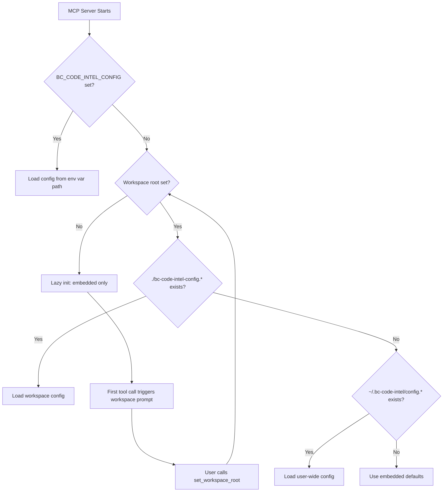

# Configuration File Discovery

## Overview

The BC Code Intelligence MCP server searches for configuration files in multiple locations with a specific priority order. Understanding this discovery process helps you place configuration files correctly for different scenarios (workspace-specific, user-wide, or environment-based).

## Discovery Priority Order

The MCP server searches these locations **in order** and uses the **first config file found**:

### **1. Environment Variable** (Highest Priority)
```bash
BC_CODE_INTEL_CONFIG=/absolute/path/to/config.json
```

**When to use:**
- CI/CD pipelines with dynamic config paths
- Testing different configurations
- Override all other config locations

**Example:**
```bash
# Linux/macOS
export BC_CODE_INTEL_CONFIG="/opt/configs/bc-code-intel-config.json"

# Windows PowerShell
$env:BC_CODE_INTEL_CONFIG = "C:\Configs\bc-code-intel-config.json"
```

### **2. Workspace Directory** (Project-Specific)
```
./bc-code-intel-config.json
./bc-code-intel-config.yaml
./bc-code-intel-config.yml
```

**When to use:**
- Project-specific layer configurations
- Team-shared settings (committed to repo)
- Project requires specific company/team layers

**Workspace detection:** Requires workspace root to be set (see Workspace Management below).

**Example:**
```bash
# In project root
MyBCProject/
├── bc-code-intel-config.json  ← Project-specific config
├── app.json
└── src/
```

### **3. User Home Directory** (User-Wide)
```
~/.bc-code-intel/config.json
~/.bc-code-intel/config.yaml
~/.bc-code-intel/config.yml
```

**When to use:**
- Personal configurations across all projects
- User-specific authentication tokens
- Default layer setup for all your work

**Path expansion:**
- Linux/macOS: `~` expands to `/home/username` or `/Users/username`
- Windows: `~` expands to `C:\Users\Username`

**Example:**
```bash
# Linux/macOS
~/.bc-code-intel/
├── config.json          ← User-wide config
└── cache/               ← Optional cache directory

# Windows
C:\Users\YourName\.bc-code-intel\
└── config.json          ← User-wide config
```

### **4. Embedded Default** (Lowest Priority)
If no configuration file is found, the server uses **embedded defaults**:
- Only embedded knowledge layer (priority 0)
- No git layers
- Diagnostic tools disabled

**When this happens:**
- Zero-configuration first-time use
- No config file in any location
- Quick testing without setup

## File Name Variations

The server recognizes these file names **in each location**:

### **JSON Format** (Most Common)
- `bc-code-intel-config.json`

### **YAML Format** (Alternative)
- `bc-code-intel-config.yaml`
- `bc-code-intel-config.yml`

**Search order within each location:**
1. `.json` checked first
2. `.yaml` checked second  
3. `.yml` checked last

## Workspace Detection and Configuration Discovery

### **The Workspace Problem**

The VS Code MCP extension doesn't set `process.cwd()` to workspace root, causing:
- Workspace directory search to fail
- Project-specific configs not found
- Project layer not loading

### **The Solution: Workspace Management (v1.5.0+)**

Use the `set_workspace_root` MCP tool:

```typescript
set_workspace_root({ 
  workspace_root: "/absolute/path/to/workspace" 
})
```

**What happens after setting workspace:**
1. `process.chdir()` changes to workspace root
2. Configuration discovery re-runs
3. Workspace config file (if exists) is now found
4. All services reinitialize with new config
5. Project layer (if configured) now loads

**Query current workspace:**
```typescript
get_workspace_root()
// Returns: { workspace_root: "/current/path", services_initialized: true }
```

## Configuration Discovery Flow



## Path Expansion Details

### **Tilde (~) Expansion**

The server expands `~` to user home directory:

**Linux/macOS:**
```bash
~ → /home/username
~/.bc-code-intel/config.json → /home/username/.bc-code-intel/config.json
```

**Windows:**
```powershell
~ → C:\Users\Username
~/.bc-code-intel/config.json → C:\Users\Username\.bc-code-intel\config.json
```

### **Relative vs Absolute Paths**

**Workspace config (relative):**
```
./bc-code-intel-config.json
# Relative to current working directory (workspace root after set_workspace_root)
```

**Environment variable (absolute):**
```bash
BC_CODE_INTEL_CONFIG=/absolute/path/to/config.json
# Must be absolute path
```

## Common Configuration Scenarios

### **Scenario 1: Individual Developer (Zero Config)**

**Setup:** No config file anywhere

**Result:**
- Embedded knowledge only
- No git layers
- Works immediately

**Use case:** Trying out BC Code Intelligence, no customization needed

---

### **Scenario 2: User-Wide Company Layer**

**Setup:** `~/.bc-code-intel/config.json`
```json
{
  "knowledge_layers": [
    {
      "name": "Company Standards",
      "type": "git",
      "priority": 20,
      "source": {
        "repository_url": "https://github.com/mycompany/bc-knowledge",
        "branch": "main",
        "auth": {
          "type": "pat",
          "token_env_var": "GITHUB_TOKEN"
        }
      },
      "enabled": true
    }
  ]
}
```

**Result:**
- Applies to all projects for this user
- Company layer always available
- Personal authentication

**Use case:** Company developer wants company standards in all projects

---

### **Scenario 3: Project-Specific Multi-Layer**

**Setup:** `./bc-code-intel-config.json` (in project root)
```json
{
  "knowledge_layers": [
    {
      "name": "Company",
      "type": "git",
      "priority": 20,
      "source": { "repository_url": "..." },
      "enabled": true
    },
    {
      "name": "Team Alpha",
      "type": "git",
      "priority": 50,
      "source": { "repository_url": "..." },
      "enabled": true
    },
    {
      "name": "Project",
      "type": "project",
      "priority": 100,
      "source": { "path": "./bc-code-intel-overrides" },
      "enabled": true
    }
  ]
}
```

**Result:**
- Project-specific layer configuration
- Committed to repo, shared with team
- Requires workspace root set in VS Code

**Use case:** Project needs specific company + team + project layers

---

### **Scenario 4: CI/CD with Dynamic Config**

**Setup:** Environment variable
```bash
export BC_CODE_INTEL_CONFIG="/ci/configs/bc-code-intel-prod.json"
```

**Result:**
- Overrides any file-based configs
- CI pipeline controls configuration
- Different configs for different pipelines

**Use case:** Automated build/test environments

## Creating Configuration File Directories

### **User-Wide Directory**

**Linux/macOS:**
```bash
mkdir -p ~/.bc-code-intel
touch ~/.bc-code-intel/config.json
```

**Windows PowerShell:**
```powershell
New-Item -Path "$env:USERPROFILE\.bc-code-intel" -ItemType Directory -Force
New-Item -Path "$env:USERPROFILE\.bc-code-intel\config.json" -ItemType File
```

### **Workspace Directory**

```bash
# Already in workspace root (after set_workspace_root)
touch bc-code-intel-config.json
```

## Troubleshooting Discovery Issues

### **"Config file not found"**

**Check each location manually:**

```bash
# 1. Environment variable
echo $BC_CODE_INTEL_CONFIG        # Linux/macOS
echo $env:BC_CODE_INTEL_CONFIG    # Windows PowerShell

# 2. Workspace directory (after workspace set)
ls -la ./bc-code-intel-config.*

# 3. User home directory
ls -la ~/.bc-code-intel/config.*
```

**Verify workspace root:**
```typescript
get_workspace_root()
```

### **"Wrong config being loaded"**

**Remember priority order:**
1. Environment variable (highest)
2. Workspace directory
3. User home directory
4. Embedded defaults (lowest)

**Solution:** Check if higher-priority config exists and is being used unintentionally.

### **"Workspace config not found in VS Code"**

**Problem:** VS Code MCP extension doesn't set workspace root

**Solution:**
```typescript
// Explicitly set workspace root first
set_workspace_root({ 
  workspace_root: "/absolute/path/to/workspace" 
})

// Now workspace config will be discovered
```

### **"Path expansion not working"**

**Check home directory expansion:**
```bash
# Linux/macOS
echo ~
# Should show: /home/username or /Users/username

# Windows PowerShell
echo $env:USERPROFILE
# Should show: C:\Users\Username
```

**Use absolute paths if tilde expansion fails:**
```bash
# Instead of: ~/.bc-code-intel/config.json
# Use: /home/username/.bc-code-intel/config.json
```

## Best Practices

1. **Choose the Right Location:**
   - User-wide: Personal settings, authentication
   - Workspace: Project-specific layer configuration
   - Environment: CI/CD, testing, dynamic scenarios

2. **Workspace Configuration in VS Code:**
   - Always call `set_workspace_root` first
   - Commit workspace config to repo for team sharing
   - Document layer purposes in project README

3. **User-Wide Configuration:**
   - Personal authentication tokens
   - Default company layer for all projects
   - Don't commit user-wide configs (they're not in workspace)

4. **Environment Variables:**
   - Use for CI/CD pipelines
   - Testing multiple configurations
   - Temporary overrides

5. **File Naming:**
   - Prefer `.json` for simplicity
   - Use `.yaml` for complex multi-layer configs (better readability)
   - Be consistent across team

## Configuration Loading Logs

When the server starts, it logs which config was loaded:

```
✅ Configuration loaded from: /path/to/bc-code-intel-config.json
```

Or if no config found:
```
ℹ️  No configuration file found, using embedded defaults
```

Check MCP server logs to verify which config is being used.

## See Also

- [Configuration File Formats](configuration-file-formats.md) - How to create config files
- [Workspace Detection Solutions](workspace-detection-solutions.md) - Solving workspace issues
- [Layer System Fundamentals](layer-system-fundamentals.md) - Understanding layer architecture
- [Git Layer Configuration](git-layer-configuration.md) - Git-specific configuration
