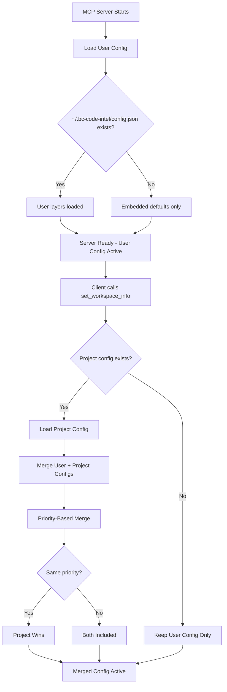

# Configuration File Discovery

## Overview

The BC Code Intelligence MCP server searches for configuration files in multiple locations. **Starting in v1.5.3**, the server loads and intelligently merges BOTH user-level AND project-level configuration files, giving you VSCode-like behavior where project configs override user configs.

## User + Project Configuration Merge (v1.5.3+)

### **How It Works**

The server now loads configurations in **two phases**:

**Phase 1: Startup (User Config)**
- Loads user-level config from `~/.bc-code-intel/config.json`
- Available immediately when server starts
- Contains your personal preferences and company-wide layers

**Phase 2: Workspace Discovery (User + Project Merge)**
- When workspace becomes known (via `set_workspace_info`)
- Loads project config from `./bc-code-intel-config.json`
- **Merges** with user config using priority-based strategy
- Project config overrides user config at same priority

### **Merge Strategy**

Layers are merged by **priority number**:
- **Same priority**: Project layer **wins** (overrides user layer)
- **Different priorities**: Both layers **included** (sorted by priority)

**Example Merge:**
```
User config (~/.bc-code-intel/config.json):
  - Layer A (priority 20)
  - Layer B (priority 30)
  - Layer C (priority 80)

Project config (./bc-code-intel-config.json):
  - Layer X (priority 30)  ← Conflicts with user Layer B
  - Layer Y (priority 40)
  - Layer Z (priority 50)

Result after merge:
  - Layer A (priority 20)  ← User (no conflict)
  - Layer X (priority 30)  ← Project wins conflict
  - Layer Y (priority 40)  ← Project (no conflict)
  - Layer Z (priority 50)  ← Project (no conflict)
  - Layer C (priority 80)  ← User (no conflict)
```

## Configuration File Locations

The MCP server searches these locations for configuration files:

## Configuration File Locations

The MCP server searches these locations for configuration files:

### **1. Environment Variable** (Explicit Override)
```bash
BC_CODE_INTEL_CONFIG=/absolute/path/to/config.json
# Legacy: BCKB_CONFIG_PATH (deprecated, use BC_CODE_INTEL_CONFIG)
```

**When to use:**
- CI/CD pipelines with dynamic config paths
- Testing different configurations
- Temporary override for debugging

**Behavior:**
- Loaded at **priority 50** in merge process
- Overrides both user and project configs at lower priorities
- Does NOT prevent user/project configs from loading

**Example:**
```bash
# Linux/macOS
export BC_CODE_INTEL_CONFIG="/opt/configs/bc-code-intel-config.json"

# Windows PowerShell
$env:BC_CODE_INTEL_CONFIG = "C:\Configs\bc-code-intel-config.json"
```

---

### **2. User-Level Configuration** (Personal + Company-Wide)

**Recommended Path:**
```
~/.bc-code-intel/config.json
~/.bc-code-intel/config.yaml
```

**Legacy Paths (deprecated):**
```
~/.bckb/config.json          ← Shows deprecation warning
~/.bckb/config.yaml
```

**System-Wide Paths:**
```
# Linux
/etc/bc-code-intel/config.json
/usr/local/etc/bc-code-intel/config.json

# Windows
C:\ProgramData\bc-code-intel\config.json
```

**When to use:**
- Company-wide knowledge layers for all projects
- Personal authentication credentials
- Default preferences across all workspaces

**Priority:** Layers in user config load at **priority 10** by default

**Example:**
```json
// ~/.bc-code-intel/config.json
{
  "layers": [
    {
      "name": "company-standards",
      "priority": 20,
      "source": {
        "type": "git",
        "url": "https://github.com/mycompany/bc-knowledge",
        "branch": "main"
      },
      "auth": {
        "type": "pat",
        "token_env_var": "GITHUB_TOKEN"
      },
      "enabled": true
    },
    {
      "name": "personal-snippets",
      "priority": 80,
      "source": {
        "type": "local",
        "path": "~/bc-knowledge-personal"
      },
      "enabled": true
    }
  ]
}
```

---

### **3. Project-Level Configuration** (Project-Specific Overrides)

**Recommended Path (in workspace root):**
```
bc-code-intel-config.json
bc-code-intel-config.yaml
```

**Legacy Filenames (deprecated):**
```
bckb-config.json             ← Shows deprecation warning
.bc-code-intel/config.json   ← Hidden directory variant
.bckb/config.json
```

**When to use:**
- Project-specific layer overrides
- Team-shared configuration (committed to repo)
- Project requires specific knowledge layers

**Priority:** Layers in project config load at **priority 20** by default

**Workspace Detection Required:** Project config only loads after workspace is set via `set_workspace_info`

**Example:**
```json
// bc-code-intel-config.json (in project root)
{
  "layers": [
    {
      "name": "project-team-alpha",
      "priority": 30,
      "source": {
        "type": "git",
        "url": "https://github.com/mycompany/team-alpha-knowledge"
      },
      "enabled": true
    },
    {
      "name": "project-overrides",
      "priority": 50,
      "source": {
        "type": "local",
        "path": "./bc-code-intel-overrides"
      },
      "enabled": true
    }
  ]
}
```

---

### **4. Embedded Default** (Always Present)

If no configuration files are found, the server uses **embedded defaults**:
- Embedded knowledge layer (priority 0)
- Standard cache and performance settings
- Diagnostic tools disabled

**When this applies:**
- Zero-configuration first-time use
- No config files in any location
- Quick testing without setup

## When to Use User vs Project Config

### **Use User Config (~/.bc-code-intel/config.json) For:**

✅ **Company-wide knowledge layers**
```json
{
  "layers": [
    { "name": "company", "priority": 20, "source": {...} }
  ]
}
```
- Applies to ALL projects you work on
- Company standards, best practices, common patterns

✅ **Personal authentication**
```json
{
  "layers": [
    {
      "name": "company",
      "priority": 20,
      "auth": {
        "type": "pat",
        "token_env_var": "GITHUB_TOKEN"  ← Your personal token
      }
    }
  ]
}
```

✅ **Personal preferences**
```json
{
  "cache": { "max_size_mb": 200 },
  "developer": { "diagnostics_enabled": true }
}
```

### **Use Project Config (./bc-code-intel-config.json) For:**

✅ **Project-specific layer overrides**
```json
{
  "layers": [
    { "name": "project-team", "priority": 30, "source": {...} }
  ]
}
```
- Only applies to this project
- Can be committed to repo and shared with team

✅ **Team-shared configuration**
- All team members get same layers
- Version controlled with project code

✅ **Override user config layers**
```json
{
  "layers": [
    // This overrides user's priority 30 layer if they have one
    { "name": "project-override", "priority": 30, "source": {...} }
  ]
}
```

## Configuration Merge Examples

### **Example 1: No Conflicts (All Layers Preserved)**

**User config:**
```json
{
  "layers": [
    { "name": "company", "priority": 20, "source": {...} },
    { "name": "personal", "priority": 80, "source": {...} }
  ]
}
```

**Project config:**
```json
{
  "layers": [
    { "name": "team-alpha", "priority": 30, "source": {...} },
    { "name": "project-local", "priority": 50, "source": {...} }
  ]
}
```

**Result:**
```
[embedded(0), company(20), team-alpha(30), project-local(50), personal(80)]
```
✅ All layers included (no priority conflicts)

---

### **Example 2: Priority Conflict (Project Wins)**

**User config:**
```json
{
  "layers": [
    { "name": "company-standard", "priority": 30, "source": {...} }
  ]
}
```

**Project config:**
```json
{
  "layers": [
    { "name": "project-specific", "priority": 30, "source": {...} }
  ]
}
```

**Result:**
```
[embedded(0), project-specific(30)]
```
✅ Project layer **replaces** user layer at priority 30

---

### **Example 3: Multiple Conflicts**

**User config:**
```json
{
  "layers": [
    { "name": "user-A", "priority": 10, "source": {...} },
    { "name": "user-B", "priority": 20, "source": {...} },
    { "name": "user-C", "priority": 30, "source": {...} }
  ]
}
```

**Project config:**
```json
{
  "layers": [
    { "name": "project-B", "priority": 20, "source": {...} },
    { "name": "project-C", "priority": 30, "source": {...} }
  ]
}
```

**Result:**
```
[embedded(0), user-A(10), project-B(20), project-C(30)]
```
✅ user-A preserved (no conflict)
✅ project-B replaces user-B (priority 20)
✅ project-C replaces user-C (priority 30)

## File Name Variations

The server recognizes these file names **in each location**:

### **Recommended (v1.5.3+)**
- `bc-code-intel-config.json`
- `bc-code-intel-config.yaml`
- `bc-code-intel-config.yml`

### **Legacy (deprecated, shows warning)**
- `bckb-config.json`
- `bckb-config.yaml`
- `bckb-config.yml`

**Search order within each location:**
1. `.json` checked first
2. `.yaml` checked second  
3. `.yml` checked last

**Deprecation warnings:** Legacy filenames trigger a warning suggesting migration to `bc-code-intel-*` naming.

## Workspace Detection for Project Config

### **The Workspace Challenge**

VS Code MCP extension doesn't automatically set workspace root, causing:
- Project config discovery to fail initially
- Project-specific layers not loading at startup

### **The Solution: set_workspace_info Tool (v1.5.0+)**

Use the `set_workspace_info` MCP tool to enable project config:

```typescript
set_workspace_info({ 
  workspace_root: "/absolute/path/to/workspace" 
})
```

**What happens after setting workspace:**
1. Configuration re-loads with workspace context
2. Project config discovered from workspace root
3. User + Project configs merged
4. All services reinitialize with merged configuration
5. Project layers (if configured) now load

**Query current workspace:**
```typescript
get_workspace_info()
// Returns: { workspace_root: "/current/path", layers_loaded: [...] }
```

## Configuration Loading Flow (v1.5.3+)



## Path Expansion Details

### **Tilde (~) Expansion**

The server expands `~` to user home directory:

**Linux/macOS:**
```bash
~ → /home/username
~/.bc-code-intel/config.json → /home/username/.bc-code-intel/config.json
```

**Windows:**
```powershell
~ → C:\Users\Username
~/.bc-code-intel/config.json → C:\Users\Username\.bc-code-intel\config.json
```

### **Relative vs Absolute Paths**

**Project config (relative to workspace):**
```
./bc-code-intel-config.json
# Relative to workspace root (set via set_workspace_info)
```

**Environment variable (absolute):**
```bash
BC_CODE_INTEL_CONFIG=/absolute/path/to/config.json
# Must be absolute path
```

## Common Configuration Scenarios (v1.5.3+)

### **Scenario 1: Individual Developer (Zero Config)**

**Setup:** No config file anywhere

**Result:**
- Embedded knowledge only
- No custom layers
- Works immediately

**Use case:** Trying out BC Code Intelligence, no customization needed

---

### **Scenario 2: User-Wide Company Layer**

**Setup:** `~/.bc-code-intel/config.json`
```json
{
  "layers": [
    {
      "name": "company-standards",
      "priority": 20,
      "source": {
        "type": "git",
        "url": "https://github.com/mycompany/bc-knowledge",
        "branch": "main"
      },
      "auth": {
        "type": "pat",
        "token_env_var": "GITHUB_TOKEN"
      },
      "enabled": true
    }
  ]
}
```

**Result:**
- Company layer loads for ALL projects
- Available immediately at server startup
- Uses your personal GitHub token

**Use case:** Company developer wants company standards in all projects

---

### **Scenario 3: User + Project Merge**

**Setup:**

User config `~/.bc-code-intel/config.json`:
```json
{
  "layers": [
    {
      "name": "company-standards",
      "priority": 20,
      "source": { "type": "git", "url": "..." },
      "enabled": true
    },
    {
      "name": "personal-snippets",
      "priority": 80,
      "source": { "type": "local", "path": "~/bc-snippets" },
      "enabled": true
    }
  ]
}
```

Project config `./bc-code-intel-config.json`:
```json
{
  "layers": [
    {
      "name": "team-alpha",
      "priority": 30,
      "source": { "type": "git", "url": "..." },
      "enabled": true
    },
    {
      "name": "project-overrides",
      "priority": 50,
      "source": { "type": "local", "path": "./bc-code-intel-overrides" },
      "enabled": true
    }
  ]
}
```

**Result after merge:**
```
Layers: [
  embedded (priority 0),
  company-standards (priority 20) ← From user config
  team-alpha (priority 30) ← From project config
  project-overrides (priority 50) ← From project config
  personal-snippets (priority 80) ← From user config
]
```

**Use case:** Developer has company layer for all projects, but this specific project adds team-specific layer

---

### **Scenario 4: Project Overrides User Layer**

**Setup:**

User config `~/.bc-code-intel/config.json`:
```json
{
  "layers": [
    {
      "name": "company-default-patterns",
      "priority": 30,
      "source": { "type": "git", "url": "https://github.com/company/default-patterns" },
      "enabled": true
    }
  ]
}
```

Project config `./bc-code-intel-config.json`:
```json
{
  "layers": [
    {
      "name": "legacy-project-patterns",
      "priority": 30,  // Same priority = project wins
      "source": { "type": "local", "path": "./legacy-patterns" },
      "enabled": true
    }
  ]
}
```

**Result after merge:**
```
Layers: [
  embedded (priority 0),
  legacy-project-patterns (priority 30) ← Project REPLACED user layer
]
```

**Use case:** Legacy project needs different patterns than company default

---

### **Scenario 5: CI/CD with Dynamic Config**

**Setup:** Environment variable
```bash
export BC_CODE_INTEL_CONFIG="/ci/configs/bc-code-intel-prod.json"
```

**Result:**
- Loads at priority 50 in merge
- Merges with user and project configs
- CI pipeline controls configuration

**Use case:** Automated build/test environments with specific layer requirements

## Creating Configuration File Directories

### **User-Wide Directory**

**Linux/macOS:**
```bash
mkdir -p ~/.bc-code-intel
touch ~/.bc-code-intel/config.json
```

**Windows PowerShell:**
```powershell
New-Item -Path "$env:USERPROFILE\.bc-code-intel" -ItemType Directory -Force
New-Item -Path "$env:USERPROFILE\.bc-code-intel\config.json" -ItemType File
```

### **Project Directory**

```bash
# In workspace root
touch bc-code-intel-config.json
```

## Troubleshooting Discovery Issues (v1.5.3+)

### **"User config not loading"**

**Check user config location:**
```bash
# Linux/macOS
ls -la ~/.bc-code-intel/config.*

# Windows PowerShell
ls "$env:USERPROFILE\.bc-code-intel\config.*"
```

**Verify file is valid:**
```bash
# Test JSON syntax
cat ~/.bc-code-intel/config.json | jq .    # Linux/macOS (if jq installed)
Get-Content "$env:USERPROFILE\.bc-code-intel\config.json" | ConvertFrom-Json  # PowerShell
```

**Check server logs:**
- Look for: `[config] Loaded user configuration: <path>`
- Deprecation warnings if using legacy paths

---

### **"Project config not loading"**

**Problem:** Project config only loads after workspace is set

**Solution:**
```typescript
// 1. Set workspace root first
set_workspace_info({ 
  workspace_root: "/absolute/path/to/workspace" 
})

// 2. Check logs for project config discovery
// Look for: [config] Loaded project configuration: <path>
// And: [config] Merged user + project configs
```

**Verify project config location:**
```bash
# Must be in workspace root
ls -la ./bc-code-intel-config.*
```

---

### **"Which config is being used?"**

**Query loaded configuration:**
```typescript
get_config_sources()
// Returns list of loaded config files and their priorities
```

**Check server logs for merge details:**
```
[config] Loaded user configuration: ~/.bc-code-intel/config.json (json)
[config] Loaded project configuration: ./bc-code-intel-config.json (json)
[config] Merged user + project configs. Active layers: embedded(p0), company(p20), team(p30), project(p50)
```

---

### **"Layer priority conflict - wrong layer loading"**

**Remember merge rules:**
- Same priority → **Project wins**
- Different priorities → Both included

**Debug priority conflicts:**
1. List all configured layers with priorities
2. Identify conflicts (same priority number)
3. Remember: Project config overrides user config at same priority

**Example conflict resolution:**
```
User: company-layer (priority 30)
Project: team-layer (priority 30)
Result: team-layer wins (project overrides user)
```

**Solution:** Adjust priorities to avoid conflicts if you want both layers

---

### **"Deprecation warnings appearing"**

**Legacy paths trigger warnings:**
```
⚠️  Using legacy config path: ~/.bckb/config.json
   Consider moving to ~/.bc-code-intel/config.json or config.yaml
```

**Migration steps:**
1. Copy existing config:
   ```bash
   cp ~/.bckb/config.json ~/.bc-code-intel/config.json
   ```
2. Test new location works
3. Remove old config file
4. Warning disappears

**Use absolute paths if tilde expansion fails:**
```bash
# Instead of: ~/.bc-code-intel/config.json
# Use: /home/username/.bc-code-intel/config.json
```

## Best Practices

1. **Choose the Right Location:**
   - User-wide: Personal settings, authentication
   - Workspace: Project-specific layer configuration
   - Environment: CI/CD, testing, dynamic scenarios

2. **Workspace Configuration in VS Code:**
   - Always call `set_workspace_root` first
   - Commit workspace config to repo for team sharing
   - Document layer purposes in project README

3. **User-Wide Configuration:**
   - Personal authentication tokens
   - Default company layer for all projects
   - Don't commit user-wide configs (they're not in workspace)

4. **Environment Variables:**
   - Use for CI/CD pipelines
   - Testing multiple configurations
   - Temporary overrides

5. **File Naming:**
   - Prefer `.json` for simplicity
   - Use `.yaml` for complex multi-layer configs (better readability)
   - Be consistent across team

## Configuration Loading Logs

When the server starts, it logs which config was loaded:

```
✅ Configuration loaded from: /path/to/bc-code-intel-config.json
```

Or if no config found:
```
ℹ️  No configuration file found, using embedded defaults
```

Check MCP server logs to verify which config is being used.

## See Also

- [Configuration File Formats](configuration-file-formats.md) - How to create config files
- [Workspace Detection Solutions](workspace-detection-solutions.md) - Solving workspace issues
- [Layer System Fundamentals](layer-system-fundamentals.md) - Understanding layer architecture
- [Git Layer Configuration](git-layer-configuration.md) - Git-specific configuration
